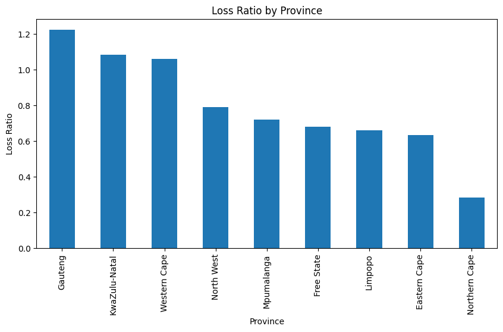
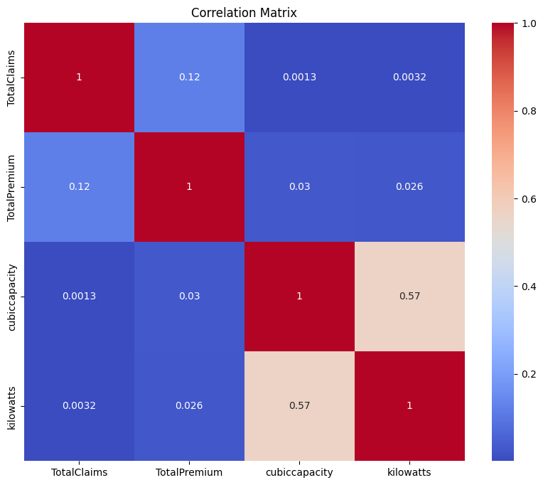
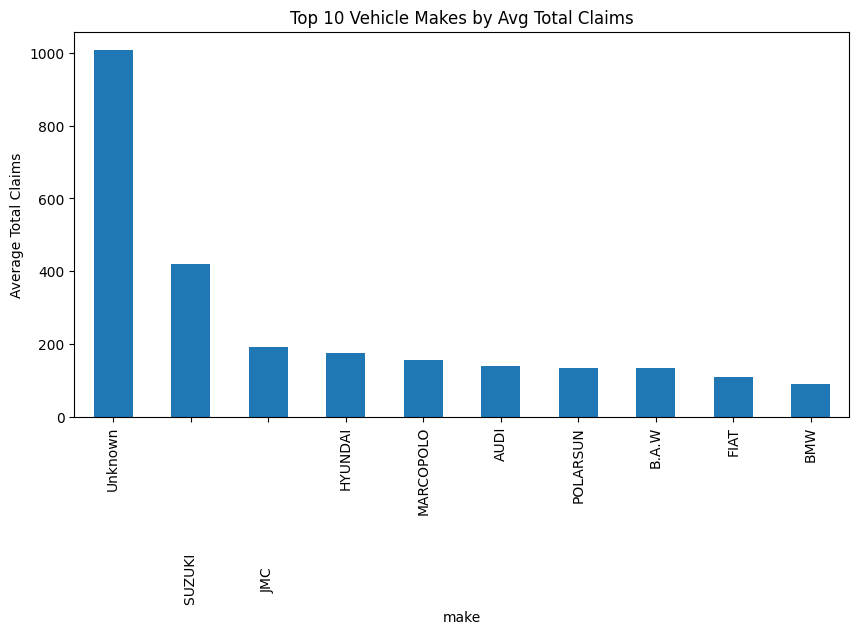

# 🚗 Insurance Risk Analysis - EDA & Data Version Control

This repository contains the exploratory data analysis (EDA), project planning, and data versioning setup for an insurance portfolio analysis project. The main objective is to uncover risk and profitability patterns in the insurance dataset and ensure full reproducibility of results using Git, GitHub, and DVC.

This project is a structured pipeline for preprocessing, analyzing, and visualizing a real-world insurance dataset using Python, pandas, matplotlib, seaborn, and other data science tools. It includes missing value handling, outlier detection, EDA (exploratory data analysis), and is integrated with DVC for dataset version control.

## 📌 Project Objectives

- Analyze risk patterns in insurance claims and premiums.
- Identify trends by geography, vehicle type, and customer attributes.
- Establish a reproducible and auditable workflow for data and model tracking.

## 🧠 Tasks Breakdown

### 🔹 Task 1: Git, GitHub & Exploratory Data Analysis (EDA)

- Created a GitHub repository with proper branching (`task-1`) and version control.
- Performed EDA to analyze:
  - **Loss Ratio** trends across Province, Gender, and Vehicle Type.
  - **Distribution** of financial variables (TotalClaims, TotalPremium, CustomValueEstimate).
  - **Outliers**, **temporal trends**, and **geographic impact**.
- Shared key insights using descriptive statistics and advanced visualizations.
- Setup basic **CI/CD** with GitHub Actions (optional).

### 🔹 Task 2: Data Version Control with DVC

- Installed and initialized DVC in the project directory.
- Configured local remote storage for data reproducibility.
- Tracked datasets with `.dvc` files and pushed to local storage.
- Ensured all changes are committed to Git for traceability.

## 📁 Project Structure

```
Insurance-Risk-Analytics-Predictive-Modeling/
├── data/                        # Raw data (tracked via DVC)
│   └── insurance_data.csv
├── notebooks/
│   └── eda_insurance.ipynb      # Jupyter notebook with EDA
├── .github/                # GitHub workflows and CI
│   └── workflows/
├── .vscode/                # Editor settings
├── utils/
│   ├── __init__.py
│   └── visualization.py # Reusable plotting utilities
├── scripts/
├── src/
├── tests/                  # Unit tests
├── output/                 # Saved plots and visual outputs
├── .dvc/                        # DVC internal config
├── .gitignore
├── README.md
└── requirements.txt
```

🛠️ Installation and Setup
Follow these steps to set up the project locally:

1. Clone the Repository:

```
git clone https://github.com/befkir/Insurance-Risk-Analytics-Predictive-Modeling
cd Insurance-Risk-Analytics-Predictive-Modeling
```

2. Create and Activate a Virtual Environment:

```
python -m venv venv
source venv/bin/activate  # On Windows: venv\Scripts\activate
```

3. Install Dependencies:

```
pip install -r requirements.txt
```

4. Run the script:

```
cd Scripts
python3 convert_to_csv.py`
```

5. Run the Jupyter Notebook:

```
jupyter notebook
```

6. 📦 DVC Setup
   This project uses DVC for dataset versioning and storage.

🧱 Initial Setup (already done)

```
dvc init
dvc add data/insurance_data.csv
git add data/insurance_data.csv.dvc .gitignore
git commit -m "Added Dataset"
```

🗃️ Set Local Remote

```
dvc remote add -d localstorage /home/user/Documents/10x/dvc_store_for_insurance_project
```

🚀 Push Data to Remote

```
dvc push
```

```
dvc stage add -n preprocess \ -d src/preprocessing.py -d data insurance_data.csv \ -o data/cleaned_data.csv \ python src/preprocessing.py
```

### 🧰 Tools and Libraries

The project utilizes the following tools and libraries:

- Python: Primary programming language.

- Pandas: Data manipulation and analysis.

## EDA Analysis Visualizations

Here are sample outputs from the sentiment analysis project:

### 1. Loss Ratio by province



### 2. Correlation



### 3. Top Vehicle makes



### 🤝 Contributing

Contributions are welcome! If you'd like to contribute:

1. Fork the Repository:

Click the "Fork" button at the top right of the repository page.

2. Clone Your Fork:

```

git clone https://github.com/befkir/Insurance-Risk-Analytics-Predictive-Modeling

```

3. Create a New Branch:

```

git checkout -b feature/your-feature-name
Make Your Changes:

```

4. Implement your feature or fix the bug.

Commit and Push:

```

git add .
git commit -m "Description of your changes"
git push origin feature/your-feature-name

```

5. Submit a Pull Request:
   Open a pull request on GitHub to merge your changes into the main branch.
